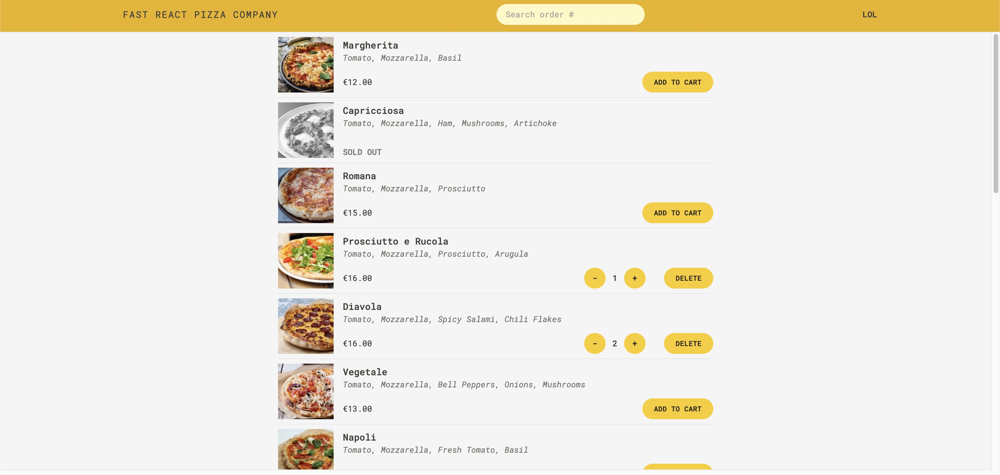
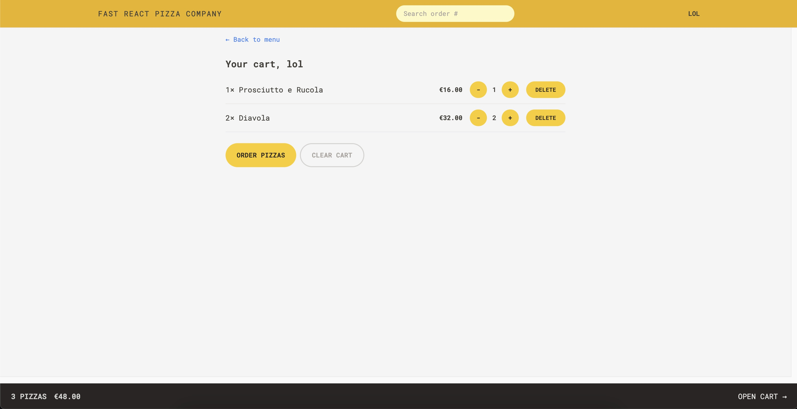
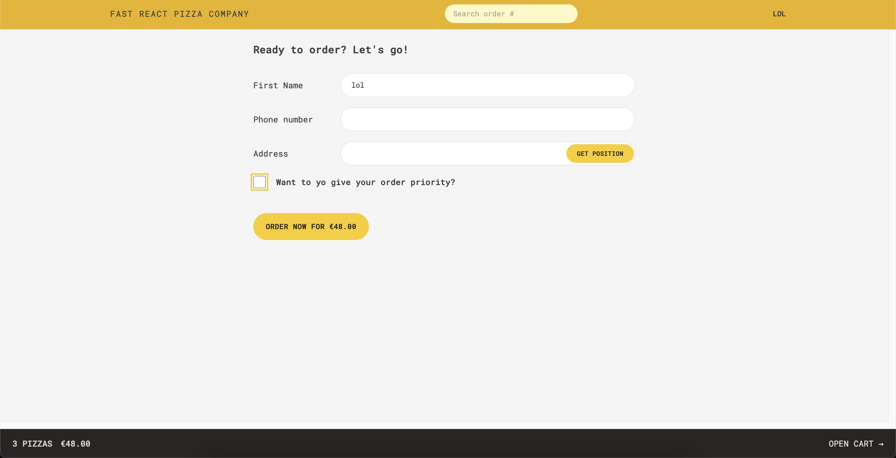
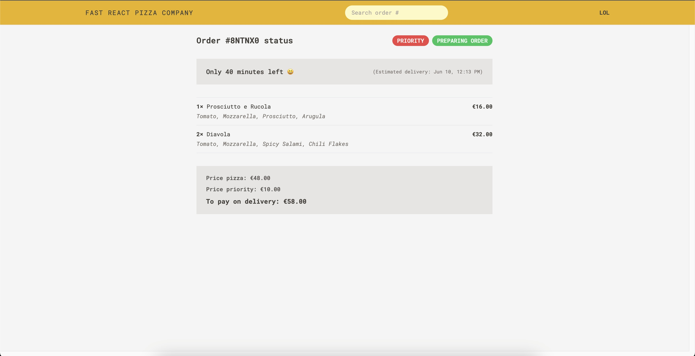

# React + TypeScript + Vite

1. Start app: npm run dev

# Visited Locations App

This is a React application built with Vite that allows users to add pizzas on the cart. Use Tailwind CSS and TypeScript. React-router-dom provide the data that is necessary for each page throw useLoaderData() function.

## Table of Contents

-   [Features](#features)
-   [Installation](#installation)
-   [Usage](#usage)

## Features

-   Add pizzas on he shopping cart
-   Select quantity
-   Delete pizza
-   Clear cart
-   Make and order, use priority, get postion
-   Check summary

## Installation

1. Clone the repository:
    ```bash
    git clone https://github.com/yourusername/fast-react-pizza.git
    ```
2. Navigate to the project directory:
    ```bash
    cd fast-react-pizza
    ```
3. Install the dependencies:
    ```bash
    npm install
    ```

## Usage

1. Start the development server:
    ```bash
    npm run dev
    ```
    Open your browser and go to `http://localhost:5173` to see the app in action.





